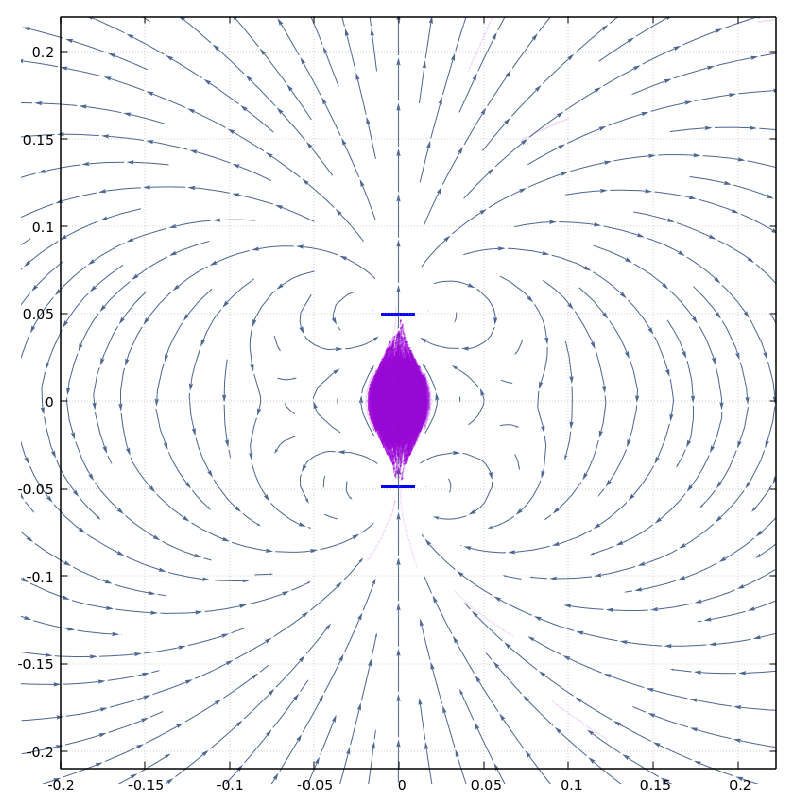

# Multiscale Particle-in-Cell algorithm


## Work in progress!

Development of a multiscale [particle in cell](https://en.wikipedia.org/wiki/Particle-in-cell) (PIC) algorithm in cuda for plasma simulations.

The scope is to build a P^3M algorithm where meshes of different sizes are constructed recursively depending on the density of the particles distribution 
so that denser regions are subdivided in smaller cells while in less dense regions only the coarser subdivisions are used.
In this way it is possible to obtain more accurate results without affecting the execution time too much.

A fully working particle-particle (PP) algorithm with openACC accellaration is also provided. 

For more details on the plasma equations on which the algorithm is build, see the notes [plasma_equations.pdf](./plasma_equations.pdf)

## Usage

### PIC algorithm:

Cuda toolkit is required.

To build the project run `make` from the PIC folder.

Use `./plasma` to launch the application.

### PP algorithm:

A compiler that support openACC directives is required for gpu acceleration (e.g. PGI).

To compile with PGI run from the PP folder:

`pgc++ plasma_pp.cpp -o plasma -acc -ta=tesla:managed -fast`
 
or without acceleration
 
`g++ plasma_cc.cpp -o plasma -fopenmp`

The details of the simulation (number and species of particles, timestep, number of iterations...) 
and the configuration of external electric and magnetic fields can be modified directly in the cpp file.  


The results consisting of the particle trajectories (and density evolution in PIC) are saved in binary format 
and can be examined using the gnuplot scripts provided, e.g.:

```
gnuplot
load "plasmaYZ_traj.plt"
```

Example of 5000 particles trajectories in magnetic bottle configuration:



## TODO (PIC)

- Fix the bug when higher orders of subdivisions are introduced
- Add update of particles velocities and temporal evolution of the system
- Import implementation of external fields from PP algorithm

